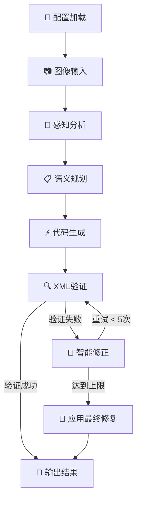

# 🎯 DWT Project - AI 驱动的图像到 XML 转换工具

[](https://python.org)
[](LICENSE)
[](README.md)

> 🚀 一个强大的多模态AI工具，能够智能分析图像内容并生成对应的XML代码

## 📖 项目简介

DWT Project 是一个基于多种AI模型的图像分析和XML代码生成工具。通过先进的多模态AI技术，它能够理解图像中的结构、关系和语义信息，然后生成高质量的XML代码。

### 🌟 核心亮点

- **🤖 多AI模型支持**: 支持智谱AI、DeepSeek、Google Gemini和OpenAI等多种AI服务
- **🧠 智能分析**: 采用"从粗到细"的分析策略，确保输出质量
- **🔄 自动修正**: 内置XML验证和智能错误修正机制
- **⚙️ 高度可配置**: 支持自定义提示词和模型参数

## ✨ 功能特性

### 🔧 多AI平台支持

- **智谱AI (ZhipuAI)**: 强大的中文多模态模型
- **DeepSeek**: 高性能的推理模型
- **Google Gemini**: 先进的多模态AI
- **OpenAI**: 业界领先的GPT模型

### 🎨 智能处理流程

- **📷 图像分析**: 深度理解图像内容和结构
- **🧩 语义规划**: 多阶段提示工程策略
- **⚡ 代码生成**: 自动生成高质量XML代码
- **🔍 质量检验**: 实时XML语法和逻辑验证
- **🔄 智能修正**: 最多5轮自动错误修正

## 📋 环境要求

| 组件 | 版本要求 | 说明 |
|------|----------|------|
| Python | 3.8+ | 推荐使用 3.9+ |
| API Key | 必需 | 至少需要一个AI服务的API密钥 |
| 内存 | 2GB+ | 用于图像处理和模型推理 |

## 🚀 快速开头

### 📥 安装步骤

1. **克隆项目**

   ```bash
   git clone <repository-url>
   cd DWT_Project
   ```

2. **创建虚拟环境** (推荐)

   ```powershell
   # Windows PowerShell
   python -m venv .venv
   .\.venv\Scripts\Activate.ps1
   
   # Windows CMD
   python -m venv .venv
   .venv\Scripts\activate.bat
   
   # Linux/macOS
   python -m venv .venv
   source .venv/bin/activate
   ```

3. **安装依赖包**

   ```powershell
   pip install -r requirements.txt
   ```

### ⚙️ 环境配置

创建 `.env` 文件并根据您选择的AI服务进行配置：

#### 方案一：使用智谱AI (推荐)

```env
# API 提供商选择
API_PROVIDER=zhipuai

# 智谱AI配置
ZHIPUAI_API_KEY=your_zhipuai_api_key_here
ZHIPUAI_MODEL=glm-4v

# 网络代理（可选）
HTTPS_PROXY=http://your_proxy:port

# 提示词配置（必需）
PERCEPTUAL_PROMPT=请分析这张图像的内容和结构...
SEMANTIC_PROMPT_TEMPLATE=基于分析结果，请生成语义规划...
CODE_GENERATION_PROMPT_TEMPLATE=请根据语义规划生成XML代码...
REFINEMENT_PROMPT_TEMPLATE=请修正以下XML代码中的错误...
```

#### 方案二：使用其他AI服务

<details>
<summary>点击查看DeepSeek配置</summary>

```env
API_PROVIDER=deepseek
DEEPSEEK_API_KEY=your_deepseek_api_key_here
DEEPSEEK_MODEL=deepseek-chat
# ... 其他配置同上
```

</details>

<details>
<summary>点击查看Google Gemini配置</summary>

```env
API_PROVIDER=gemini
GEMINI_API_KEY=your_gemini_api_key_here
GEMINI_MODEL=gemini-pro-vision
# ... 其他配置同上
```

</details>

<details>
<summary>点击查看OpenAI配置</summary>

```env
API_PROVIDER=openai
OPENAI_API_KEY=your_openai_api_key_here
OPENAI_MODEL=gpt-4-vision-preview
# ... 其他配置同上
```

</details>

## 📱 使用方法

### 🎯 基本使用

1. **准备图像文件**

   ```powershell
   # 将您的图像文件重命名为 transformer.jpg 并放在项目根目录
   # 支持的格式：JPG, PNG, GIF, WebP
   cp your_image.jpg transformer.jpg
   ```

2. **运行程序**

   ```powershell
   # 激活虚拟环境（如果使用）
   .\.venv\Scripts\Activate.ps1
   
   # 运行主程序
   python main.py
   ```

3. **查看结果**

   ```powershell
   # 生成的XML代码保存在 output.xml 文件中
   # 可以用任何文本编辑器或XML查看器打开
   notepad output.xml
   ```

### 🔧 高级用法

```python
# 在代码中直接调用
from main import run_planning_stage, run_generation_stage

# 执行分析和生成
plan = run_planning_stage("your_image.jpg")
if plan:
    xml_output = run_generation_stage(plan)
    if xml_output:
        print("XML生成成功！")
```

## 📂 项目结构

```text
DWT_Project/
├── 📄 main.py                 # 🚀 主程序入口
├── 📄 requirements.txt        # 📦 Python依赖包列表
├── 📄 README.md              # 📖 项目文档（本文件）
├── 📄 .env                   # ⚙️ 环境变量配置文件（需创建）
├── 📄 .gitignore             # 🚫 Git忽略文件配置
├── 🖼️ transformer.jpg         # 📷 输入图像文件（示例）
├── 📄 output.xml             # 📝 输出XML文件（程序生成）
├── 📁 .venv/                 # 🐍 Python虚拟环境
├── 📁 __pycache__/           # 🗂️ Python缓存文件
└── 📄 可以画架构图的.pdf       # 📋 项目相关文档
```

## 🔄 工作流程



### 详细步骤说明

| 步骤 | 说明 | 技术栈 |
|------|------|--------|
| 🔧 **配置加载** | 加载环境变量、API密钥和提示词模板 | Python, dotenv |
| 📷 **图像输入** | 读取并编码图像文件为base64格式 | PIL, base64 |
| 🧠 **感知分析** | 使用多模态AI模型分析图像内容和结构 | AI API |
| 📋 **语义规划** | 基于感知结果生成结构化的语义规划 | 提示工程 |
| ⚡ **代码生成** | 根据语义规划生成初始XML代码 | AI生成 |
| 🔍 **XML验证** | 验证XML语法正确性和逻辑合理性 | lxml, etree |
| 🔧 **智能修正** | 自动识别和修正XML中的错误 | AI修正 |
| 💾 **输出结果** | 保存最终的高质量XML文件 | 文件系统 |

## 🎨 技术架构

### 🏗️ 核心技术栈

- **🐍 Python 3.8+**: 主要编程语言
- **🤖 多模态AI**: 图像理解和代码生成
- **📊 lxml**: XML处理和验证
- **🖼️ Pillow**: 图像处理和编码
- **⚙️ python-dotenv**: 环境变量管理
- **🌐 requests**: HTTP API调用

### 🧠 AI模型支持

| 提供商 | 模型 | 特色 | 适用场景 |
|--------|------|------|----------|
| 🇨🇳 **智谱AI** | glm-4v | 中文友好，多模态 | 中文图像分析 |
| 🔬 **DeepSeek** | deepseek-chat | 高性能推理 | 纯文本处理 |
| 🌐 **Google** | gemini-pro-vision | 先进视觉理解 | 复杂图像分析 |
| 🚀 **OpenAI** | gpt-4-vision | 业界标准 | 全场景应用 |

## 🔧 故障排除

### ❓ 常见问题及解决方案

<details>
<summary>🔑 API Key相关问题</summary>

**问题**: API调用失败，提示API Key错误
**解决方案**:
```powershell
# 1. 检查.env文件中的API Key是否正确设置
cat .env | grep API_KEY

# 2. 确认API Key格式正确（无多余空格或换行）
# 3. 验证API Key是否有效且有足够配额
# 4. 检查API_PROVIDER设置是否与API Key匹配
```

</details>

<details>
<summary>🌐 网络连接问题</summary>

**问题**: 网络请求超时或连接失败
**解决方案**:
```powershell
# 1. 检查网络连接
ping api.openai.com

# 2. 配置代理（如需要）
set HTTPS_PROXY=http://your-proxy:port

# 3. 测试API连接
curl -H "Authorization: Bearer your-api-key" https://api.openai.com/v1/models
```

</details>

<details>
<summary>🖼️ 图像处理问题</summary>

**问题**: 图像文件无法读取或处理失败
**解决方案**:
```powershell
# 1. 检查图像文件是否存在
ls transformer.jpg

# 2. 验证图像格式和大小
file transformer.jpg

# 3. 转换图像格式（如需要）
python -c "from PIL import Image; Image.open('input.png').save('transformer.jpg')"
```

</details>

<details>
<summary>📄 XML生成问题</summary>

**问题**: XML生成失败或格式错误
**解决方案**:
```powershell
# 1. 检查提示词配置是否完整
grep -E "PROMPT|TEMPLATE" .env

# 2. 验证AI模型响应
# 3. 检查生成的XML语法
python -c "from lxml import etree; etree.parse('output.xml')"
```

</details>

### 🐛 调试模式

启用详细日志输出：

```python
import logging
logging.basicConfig(level=logging.DEBUG)

# 在main.py中添加调试信息
print(f"使用API提供商: {API_PROVIDER}")
print(f"模型名称: {MODEL_NAME}")
print(f"图像文件大小: {os.path.getsize('transformer.jpg')} bytes")
```

## 🛠️ 开发指南

### 🏗️ 架构设计

```python
# 核心类和函数
class APIProvider(Enum):          # AI服务提供商枚举
    ZHIPUAI = "zhipuai"
    DEEPSEEK = "deepseek" 
    GEMINI = "gemini"
    OPENAI = "openai"

# 核心函数
def call_api()                    # 🌐 统一API调用接口
def run_planning_stage()          # 📋 执行规划阶段
def run_generation_stage()        # ⚡ 执行生成阶段
def validate_xml()                # ✅ XML验证功能
```

### 🔌 扩展开发

#### 添加新的AI提供商

1. **在`APIProvider`枚举中添加新提供商**
```python
class APIProvider(Enum):
    NEW_PROVIDER = "new_provider"
```

2. **实现对应的API调用函数**
```python
def call_new_provider_api(prompt: str, image_path: Optional[str] = None, max_tokens: int = 2000) -> Optional[str]:
    # 实现API调用逻辑
    pass
```

3. **注册到API函数映射**
```python
API_FUNCTIONS = {
    # ... 现有映射
    APIProvider.NEW_PROVIDER.value: call_new_provider_api,
}
```

#### 自定义提示词模板

```python
# 在.env文件中自定义提示词
PERCEPTUAL_PROMPT=请详细分析这张图像的技术架构...
SEMANTIC_PROMPT_TEMPLATE=基于图像分析，生成详细的组件关系图...
CODE_GENERATION_PROMPT_TEMPLATE=请生成符合draw.io格式的XML代码...
REFINEMENT_PROMPT_TEMPLATE=修正XML代码中的语法错误和逻辑问题...
```

### 📊 性能优化

- **图像压缩**: 自动调整图像大小以减少API调用成本
- **缓存机制**: 缓存相同图像的分析结果
- **并发处理**: 支持批量图像处理
- **错误重试**: 智能重试机制，提高成功率

## 📜 许可证

本项目采用 [MIT License](LICENSE) 开源协议。

## 🤝 贡献指南

我们欢迎所有形式的贡献！

### 🌟 如何贡献

1. **🍴 Fork** 本仓库
2. **🌿 创建** 功能分支 (`git checkout -b feature/AmazingFeature`)
3. **💾 提交** 更改 (`git commit -m 'Add some AmazingFeature'`)
4. **📤 推送** 到分支 (`git push origin feature/AmazingFeature`)
5. **🔄 创建** Pull Request

### 📋 贡献类型

- 🐛 **Bug修复**: 报告和修复程序错误
- ✨ **新功能**: 添加新的功能特性
- 📚 **文档**: 改进文档和使用说明
- 🎨 **代码优化**: 提升代码质量和性能
- 🧪 **测试**: 添加或改进测试用例

---

<div align="center">

**⭐ 如果这个项目对您有帮助，请给我们一个Star！**

[](https://github.com/your-username/DWT_Project)
[](https://github.com/your-username/DWT_Project)

**📅 最后更新:** 2025年10月22日 | **👥 维护者:** [Your Name](https://github.com/your-username)

</div>
